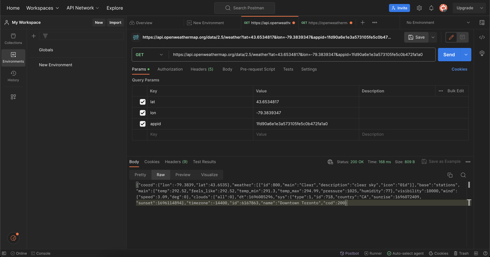

# Weather-Warriors

## Program Domain
Trading Card Game

## Description
A multiplayer trading card game with variability based on weather, temperature and location. Once a player logs in, they have access
to a collection of cards with different attributes, and they can build and customize a deck which is saved to their account. 
Upon entering a game, an "arena" which is based off a geographical location is chosen from a set collection. These arenas will have
specific attributes based on their weather in real time, which will give certain advantages/disadvantages to cards. During the game,
players have a hand (cards they have direct access to) and deck (cards needing to be drawn randomly). One player wins when the other
player's cards are all defeated.

## API
[Open Weather current weather API](https://openweathermap.org/current)

## API Screenshot

## Example Output of Our Java Code
Response{protocol=http/1.1, code=200, message=OK, url=https://api.openweathermap.org/data/2.5/weather?lat=43.6534817&lon=-79.3839347&appid=1fd90a6e1e3a573105fe5c0b472fa1a0}
{"coord":{"lon":-79.3817,"lat":43.6459},
"weather":[{"id":800,"main":"Clear","description":"clear sky","icon":"01n"}],
"base":"stations","main":{"temp":292.89,"feels_like":292.9,"temp_min":291.66,"temp_max":295.96,"pressure":1024,"humidity":76},
"visibility":10000,"wind":{"speed":2.06,"deg":270},"clouds":{"all":0},"dt":1696115909,
"sys":{"type":1,"id":941,"country":"CA","sunrise":1696072408,"sunset":1696114894},"timezone":-14400,"id":6167863,
"name":"Downtown Toronto","cod":200}

## Technical Problems
While working with the API, we ran into problems with certain SDK's. Most notably, we would receive an error message saying version 20 was
not supported, even though the SDK we had used was not version 20. To work around this, we simply decided on using a different SDK for the 
project.
